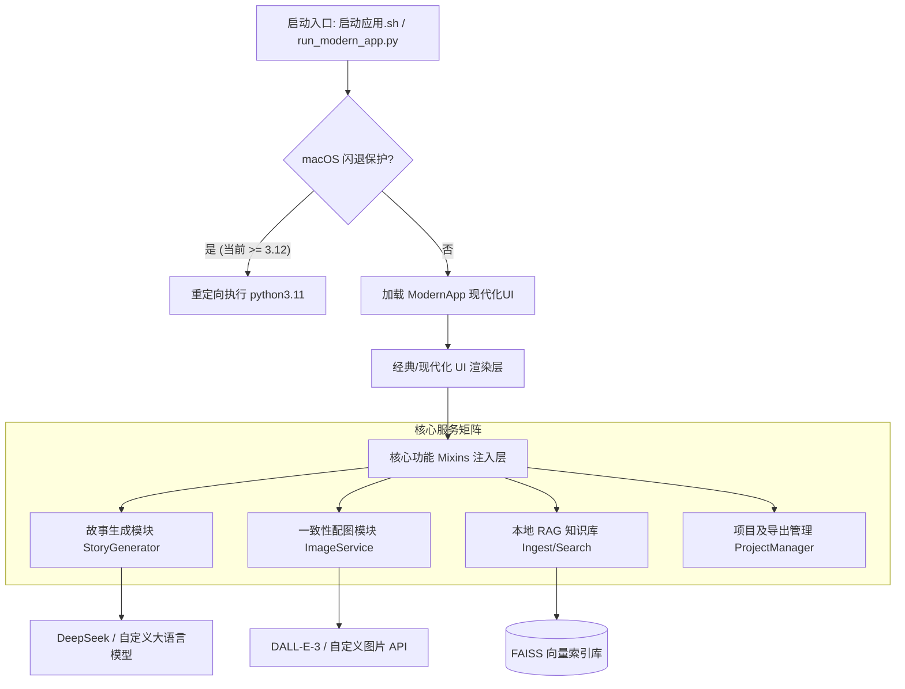

# ScriptWeaver 🤖✨

**ScriptWeaver** 是一款基于 Tkinter 的现代化、轻量化且高健壮性的本地故事创作助手。它专为知乎短篇小说及长篇连载创作设计，深度整合了 **本地 RAG 检索增强技术**、**一键多阶段故事生成流**、**角色人设一致性配图系统**，并配备了针对 macOS 环境的高可靠启动保护机制。

---

## 🎨 核心功能亮点

1. **现代化科技风 UI 界面** (`src/gui/modern_app.py`)
   * 基于 Tkinter 深度定制的深色与浅色双模主题。
   * 优雅的主题动态更新系统，支持全屏组件响应、圆角边框、自定义组件态。
   * 输入框及标签在高对比度深色模式下字迹清晰，操作流程顺畅。
2. **经典 Tkinter UI 回退机制** (`src/gui_app.py` / `src/gui/main_window.py`)
   * 当现代化 UI 加载或渲染在老旧设备异常时，启动器会自动降级并调起经典 Tkinter UI，确保 100% 可用性。
3. **macOS 启动安全重定向 (Re-exec 保护)** (`run_modern_app.py`)
   * *技术痛点*：在 macOS 上使用 Python 3.12 运行 Tkinter 程序，极易触发底层原生 Tk 运行时的线程或窗口崩溃。
   * *防闪退设计*：启动器自动探测系统中的 Python 3.11 运行时。如果当前在 Python 3.12 环境下运行，它将以透明重定向（`os.execve`）的方式，无缝切换到 `python3.11` 引擎运行，从而完美规避系统闪退。
4. **多阶段小说生成控制流** (`src/gui/mixins/story_modules/`)
   * **目录/大纲预生成**：结合创作需求、故事种类及细分风格，一键输出多章节目录。
   * **分章独立创作**：支持选择任意章节进行生成，支持续写、预览与反复重生成对比。
   * **连更控制系统**：支持自动流水线式撰写，系统会自动对各章节的衔接进行过渡修复（Transition Repair）和尾部补完（Tail Completion），保持全书剧情和逻辑闭环。
5. **本地 RAG 知识库检索增强** (`src/kb/`, `src/story_cli.py`)
   * **本地向量数据库**：支持将本地的 `.txt`、`.docx`、`.pdf` 格式的优质素材或历史文章导入，利用 sentence-transformers + FAISS 构建高精度的语义向量索引。
   * **知乎体 RAG 增强**：在故事大纲和内容生成时，自动从素材库检索最相似的上下文片段并拼装至 Prompt。生成的短文自带知乎“高热度回答”的叙事口吻和结构美感。
6. **角色一致性 AI 绘图系统** (`src/gui/services/image_service.py` / `src/gui/mixins/image_modules/`)
   * 支持对接 OpenAI DALL-E-3、DALL-E-2 以及各类自定义 API 预设。
   * **角色人设管理器**：专门管理角色的长相、衣着、性格等 Visual Prompts，确保生成的插画在不同场景中人物面部、服装风格保持极高一致性，解决传统 AI 配图“配角变主角、长相每张不同”的硬伤。

---

## 🏗️ 项目技术架构

项目的逻辑层和渲染层完全解耦，以 `Mixins` 注入机制构建了丰富的功能矩阵：



---

## ⚙️ 环境要求与依赖安装

* **操作系统**：macOS (推荐 13+) / Linux / Windows 10+
* **Python 版本**：极力推荐使用 **`Python 3.11`**。
* **Tkinter 支持**：确保 Python 环境自带或已安装 `tkinter` 组件。

### 1. 快捷依赖安装

```bash
pip install -r requirements.txt
```

*若想启用高级知识库（RAG）功能，请安装额外支持：*
```bash
pip install faiss-cpu python-docx pypdf
```

### 2. 本地自检脚本

```bash
# 1. 验证 tkinter 库是否正常且未损坏
python -c "import tkinter as tk; r=tk.Tk(); r.withdraw(); r.destroy(); print('tkinter 可用')"

# 2. 验证主程序正常导入，无 Circular Import
python -c "from src.gui.modern_app import ModernApp; print('主程序现代化UI组件加载成功')"
```

---

## 🚀 启动方式

项目提供了针对不同操作环境及 Conda 管理器的多套极简化启动方案。

### 方案 A：一键自适应启动（推荐，全平台 macOS / Linux）

```bash
./启动应用.sh
```
* **特点**：此脚本具有高鲁棒性。它会自动探测系统已安装的 Python 环境，在 macOS 上识别并绕过不兼容的 3.12 版本，挑选最稳定、拥有 Tkinter 支持的 `python3.11` 加载运行。

### 方案 B：本地 conda 环境专属启动 (适用于 Conda 虚拟环境 `work`)

```bash
./start_with_work_env.sh
```
* **特点**：专为本地配有 Conda 且命名为 `work` 的环境而设计。激活后会自动检查 `openai`, `faiss`, `sentence_transformers` 等核心包版本，并自动安全拉起 Modern UI。

### 方案 C：双击快捷启动（Windows 平台）

直接双击运行根目录的：
```cmd
启动应用.bat
```

### 方案 D：手动显式调用

```bash
python run_modern_app.py
```
*如果您的 macOS 存在多环境，可以直接强制用 Python 3.11 稳定启动：*
```bash
/opt/homebrew/bin/python3.11 run_modern_app.py
```

---

## 📝 快速创作指南

1. **API 配置与快速切换**：
   * 启动程序后，点击顶部的 **“设置”** 标签。
   * 配置您的模型密钥（例如配置“自定义”或 DeepSeek 预设，填写 API Key、Base URL 及特定 Model）。
   * 在“⚡ 快速 API 切换”处，故事生成及图片生成都一键选定保存，即时生效。
2. **大纲创作**：
   * 进入“故事生成”标签页，在输入框中写下您的短篇主题需求（如 *“一个被困在时间循环里的程序员，每次死掉都能多获得一行代码”*）。
   * 选择您心仪的故事类型（职场/科幻/情感等）和故事风格，点击 **“生成目录”**。
3. **章节创作与补齐**：
   * 目录生成完成后，系统将在下方呈现全书总览和结构章节。
   * 您可以单选某一章生成，也可以点击 **“自动生成全部”** 连贯生成整书。
   * 期间可通过图片管理器为特定角色生成固定特征的角色卡片。

---

## 📂 项目结构概览

```text
├── config/                  # 动态及缓存配置（API配置及主题缓存）
├── data/
│   └── raw/                 # 放置您的参考素材 (.txt / .md / .pdf)，用于构建RAG
├── docs/                    # 用户指南及系统说明文档
├── index/                   # 本地知识库的 FAISS 向量索引物理存储
├── projects/                # 保存的所有短篇故事项目（正文、目录大纲、角色图片等）
├── src/
│   ├── clients/             # LLM 及 绘图 API 客户端（含 DeepSeek, OpenAI 等）
│   ├── core/                # 系统核心控制逻辑
│   ├── gui/                 # 现代化 UI 组件、核心 Mixins（故事生成控制流、绘图服务）
│   ├── kb/                  # 向量知识库数据分块、导入、语义匹配实现
│   └── utils/               # 工具函数
├── tests/                   # 完整的高覆盖率回归测试包 (50+测试文件)
├── requirements.txt         # 基础依赖依赖项
├── run_modern_app.py        # 统一的高健壮性 UI 启动入口（含防闪退重定向）
├── start_with_work_env.sh   # 本地 Conda 环境专属启动脚本
└── 启动应用.sh               # 推荐的 macOS/Linux 一键启动脚本
```

---

## 🧪 自动化测试与持续回归

本项目拥有极其雄厚的单元测试保障（**190+ 测试用例**），覆盖了 API 回退机制、安全配置项加密导出、角色 Prompt 构建策略、Transition 过渡修复、RAG 向量搜索流程等多维度：

在项目根目录下，直接键入即可跑完全程：
```bash
pytest -q
```

---

## 📄 开源许可证

本项目基于 **MIT License** 许可开源。使用本项目生成的文本及图片内容请遵守当地法律法规。
