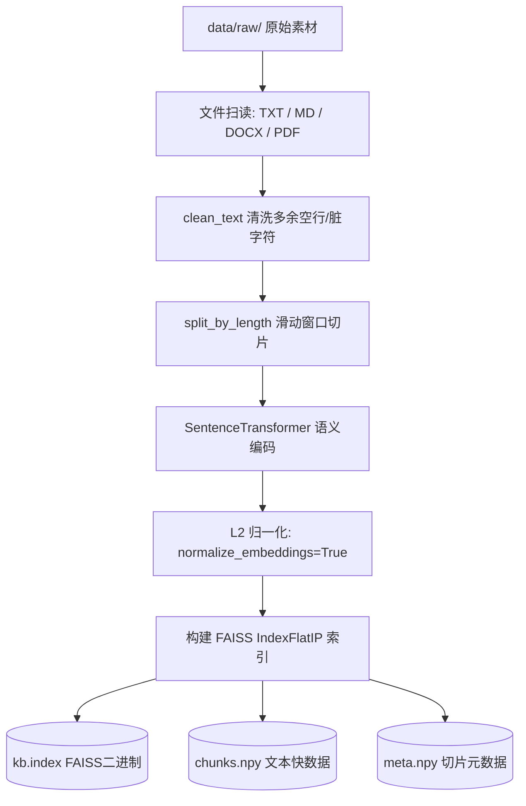

# 🤖 ScriptWeaver - 核心技术架构与核心步骤具体实现设计规约 (超详版)

## 📖 文档导言
本规约旨在为开发团队提供 **ScriptWeaver**（智能故事编织平台）的底层架构、核心模块、算法级设计以及代码逻辑的最详尽技术解析。本文档涵盖了从系统启动、分块语义检索（RAG）、智能大纲对齐、高平滑后台流式生成、后置并行修复机制到角色视觉 DNA 一致性绘图等所有环节的深度剖析。

---

## 🎨 1. 系统完整技术栈与目录架构

ScriptWeaver 的核心设计原则是 **“高可用性、极高生成连贯性、强 UI/UX 响应性”**。

### 1.1 完整的依赖矩阵
* **GUI 核心层**：`tkinter` + `ttk` (原生，基于系统底层 Tcl/Tk 运行时)
* **向量检索 (RAG) 层**：
  - `faiss-cpu` (提供高维向量空间的最邻近检索，免服务端)
  - `sentence-transformers` (词向量编码，预置模型：`paraphrase-multilingual-MiniLM-L12-v2`)
  - `numpy` (矩阵运算与向量存储缓存)
  - `python-docx` / `pypdf` (底层 Office/PDF 文档流解析提取)
* **大模型与多模态层**：
  - `openai` / `requests` (进行 HTTP REST 交互，兼容 OpenAI / DeepSeek 等自定义 Base URL)
  - `python-dotenv` (运行时敏感配置注入与持久化)
* **测试与持续质量保障**：
  - `pytest` (覆盖率回归测试框架，包含 190+ 个单元测试用例)

### 1.2 物理目录树拓扑
```text
├── config/                  # 动态及缓存配置（API配置及主题缓存）
├── data/
│   └── raw/                 # 放置您的参考素材 (.txt / .md / .pdf)，用于构建RAG
├── docs/                    # 用户指南及系统说明文档
│   ├── 使用指南.md
│   └── technical_architecture.md  # 本文档 (本地版本)
├── index/                   # 本地知识库的 FAISS 向量索引物理存储
│   ├── kb.index             # FAISS 物理向量库文件
│   ├── chunks.npy           # 原始文本切片缓存
│   └── meta.npy             # 文本切片来源及索引元数据缓存
├── projects/                # 保存的所有短篇故事项目（正文、目录大纲、角色图片等）
├── src/
│   ├── clients/             # LLM 及 绘图 API 客户端（含 DeepSeek, OpenAI, 腾讯混元等）
│   ├── core/                # 系统核心控制逻辑 (exceptions, logging)
│   ├── gui/                 # 现代化 UI 组件、核心 Mixins（故事生成控制流、绘图服务）
│   │   ├── helpers/         # 剧情评估、情绪控制、精修 Prompts 工具库
│   │   ├── mixins/          # 业务逻辑注入器 (Outline, Story, Project)
│   │   ├── theme.py         # HSL 现代主题引擎 (支持 Dark / Light 动态渲染)
│   │   └── modern_app.py    # 主应用视窗入口
│   ├── kb/                  # 向量知识库数据分块、导入、语义匹配实现
│   └── utils/               # 全局工具函数 (text, json)
├── tests/                   # 完整的高覆盖率回归测试包 (190+测试文件)
└── run_modern_app.py        # 统一的高健壮性 UI 启动入口（含防闪退重定向）
```

---

## 🏗️ 2. 系统拓扑架构与异步通信原理

ScriptWeaver 将**渲染层 (UI Thread)** 与**执行层 (Worker Thread)** 完全解耦。UI 线程仅负责用户的交互反馈与缓冲数据的定时刷新，而所有高延迟的 CPU 密集型任务（如 RAG 编码）和网络 I/O 密集型任务（如 LLM 续写）均通过后台 Worker 线程进行流式通信。

```
┌─────────────────────────────────────────────────────────────┐
│                       UI Thread (主线程)                    │
│   - ModernApp.mainloop() 消息循环                           │
│   - 定时刷新流式缓冲区 (每 100ms / 积攒 30字)                │
│   - 安全投递分发回调 self._ui(action)                       │
└──────────────────────────────┬──────────────────────────────┘
         ▲                     │                    ▲
         │ (UI 更新指令)       │ (启动后台任务)     │ (投递并发任务结果)
         │                     ▼                    │
┌────────┴──────────────────────────────────────────┴─────────┐
│                     Worker Threads (工作线程)               │
│   - Ingest / Search 向量检索                                │
│   - SSE 流式客户端 (stream) 获取 Token                      │
│   - ThreadPoolExecutor 并行运行后置修复任务 (MaxWorkers=4)   │
└─────────────────────────────────────────────────────────────┘
```

---

## 💻 3. 核心步骤的具体实现与代码解析

### 3.1 macOS 启动环境自适应保护 (Re-exec 保护)
* **核心代码位置**：`run_modern_app.py`
* **技术痛点**：macOS 上的 Tkinter 原生 Tcl/Tk 引擎，在多线程高并发及 Python 3.12 渲染下，极易由于内存冲突抛出底层 Core Dump 或直接闪退。
* **具体算法实现**：
  1. 运行时首先检查当前平台，如果是 macOS 且 Python 版本 `>= 3.12`，且未带有 `STORY_LAUNCHER_REEXEC_DONE` 标记，则强行介入。
  2. 自动搜索系统的 Python 3.11 稳定二进制文件。
  3. 执行轻量级探针命令：
     ```python
     def _can_import_tkinter(py_bin: str) -> bool:
         try:
             probe = subprocess.run(
                 [py_bin, "-c", "import tkinter"],
                 stdout=subprocess.DEVNULL,
                 stderr=subprocess.DEVNULL,
                 timeout=8,
                 check=False,
             )
             return probe.returncode == 0
         except Exception:
             return False
     ```
  4. 搜寻成功后，使用 Python 原生兼容的 `os.execve` 强制将当前进程的映像完全替换（完全替换内存映像，开销极低），实现运行环境的平滑回滚：
     ```python
     env = os.environ.copy()
     env["STORY_LAUNCHER_REEXEC_DONE"] = "1"
     os.execve(safe_py, [safe_py, str(Path(__file__).resolve()), *sys.argv[1:]], env)
     ```
  5. 如果现代化模块由于物理缺损仍然无法渲染，系统将在外层接住异常，自动调起经典模块 `from src.gui_app import App`，确保程序不发生“死闪退”。

---

### 3.2 本地向量知识库 (RAG) 语义分块建库与匹配检索
* **核心代码位置**：`src/kb/ingest.py`, `src/kb/search.py`
* **数学与工程原理**：
  
  1. **文档扫描**：支持递归检索原始目录，自动提取 `.docx`（通过 python-docx 解析 XML）以及 `.pdf`（通过 pypdf 提取 page text），过滤无意义噪声字符。
  2. **带重叠的文本切片窗口**：
     设定分块大小为 $W = 800$ 字符，重叠大小为 $O = 120$ 字符。对输入的长篇文本 $T$ 进行切片。第 $i$ 个切片的字符区间为：
     $$\text{Chunk}_i = T[i \cdot (W - O) : i \cdot (W - O) + W]$$
  3. **高维空间编码与 L2 归一化**：
     为了将语义映射至同一个高维空间，使用 MiniLM 模型生成 384 维稠密实数向量 $\vec{v}$。为保证后续直接使用内积计算余弦相似度，将得到的向量进行 L2 归一化：
     $$\vec{v}_{\text{norm}} = \frac{\vec{v}}{\|\vec{v}\|_2}$$
  4. **FAISS 索引构建**：
     ```python
     embeddings = self._embed(chunks).astype("float32")
     # IndexFlatIP 对应 Inner Product，因为 embeddings 已经做过 L2 归一化，
     # 内积计算即等同于计算 Cosine Similarity
     index = self._faiss.IndexFlatIP(embeddings.shape[1])
     index.add(embeddings)
     ```
     最终把索引和元数据打包写入物理磁盘。
  5. **语义 Top-K 检索**：
     检索时，对查询词 Query 同样进行归一化编码。调用索引：
     ```python
     scores, idxs = self.index.search(emb, topk)
     ```
     只保留得分 $> 0$ 的最相关行，拼接回 Context，灌入生成 Prompt 中。

---

### 3.3 大纲大模型对齐机制 (Outline Alignment)
* **核心代码位置**：`src/gui/mixins/story_modules/outline_quality_mixin.py`
* **具体算法实现**：
  1. 拦截开启开关 `STORY_OUTLINE_ALIGN=1`。
  2. 生成大纲后，异步触发大模型的打分评估接口。评估模型会对核心大纲文本进行打分并做实体对比。如果发现大纲并未出现用户提词中所指示的背景词，或者情节偏题，则评估打分为不通过（`passed = False`）。
  3. **纠偏控制循环**：
     在重试迭代中，降低模型的 `Temperature` 系数以增加确定性（防止模型在纠偏时继续天马行空）。
     ```python
     # 温度递减策略
     current_temp = max(0.3, base_temperature - 0.25 - (attempt - 1) * 0.05)
     ```
     将评估报告中吐出的缺失实体（`missing_tokens`）合并，重新组织为高权重 Prompt：
     ```text
     【强约束输出（必须满足）】
     - 目录必须明显出现：{missing_text}
     - 至少有两章标题能直接体现上述核心冲突。
     请重新微调生成大纲：
     ```
  4. **降级拼贴处理**：
     如果 3 次大模型重试纠偏仍然判定失败，将开启本地硬对齐逻辑（`_repair_outline_for_alignment`），通过正则表达式强行在首尾章节中拼贴入核心需求词。

---

### 3.4 线程安全的高平滑流式故事生成
* **核心代码位置**：`src/gui/mixins/story_modules/story_generator.py`
* **具体算法实现**：
  1. **异步执行与 UI 线程锁保护**：
     Tkinter 本身并非线程安全，子线程直接调用 UI 属性极易导致 GUI 崩溃。系统定义了安全委派机制 `self._ui(func, *args)`，它会排队投递动作回主 UI 线程执行。
  2. **高吞吐量 SSE 流式缓冲区**：
     流式推送 Token 速率极快（约 50-80 tokens/sec）。为了避免主线程由于高频文本插入导致渲染负载过高而出现“假死”，设计了基于时间与长度双重因子的缓冲器：
     ```python
     STREAM_BUFFER_SIZE = 30      # 字符累积达30个
     STREAM_FLUSH_INTERVAL = 0.1  # 或时间过去100ms
     ```
     大模型 streaming 输出的数据流经以下核心缓冲环：
     ```python
     def flush_buffer(force: bool = False) -> None:
         nonlocal buffer_text, last_flush
         now = time.time()
         should_flush = (
             force
             or len(buffer_text) >= self.STREAM_BUFFER_SIZE
             or (now - last_flush) >= self.STREAM_FLUSH_INTERVAL
         )
         if should_flush and buffer_text:
             text_to_insert = buffer_text
             buffer_text = ""
             last_flush = now
             # 确保使用线程安全的 UI 主回调
             self._ui(lambda: (self.output.insert(END, text_to_insert), self.output.see(END)))
     ```
  3. **多轮接续续写环 (Auto-Continuation)**：
     当单次大模型在达到 output limits（通常为 1500 字）自动断开时，若字数仍偏少，触发续写循环。
     截取前文末尾的 1400 字（包含丰富的语法特征与语境），通过以下模版接力：
     ```text
     请在不重复前文的前提下继续正文，重点补强紧张感与戏剧性：
     1) 立刻推进情节，不要复述；
     2) 增加人物决策与代价；
     3) 续写约 {remaining} 字。
     以下为前文末尾（用于衔接）：
     {accumulated_tail}
     ```

---

### 3.5 并行后处理修复与智能质量控制流水线
* **核心代码位置**：`src/gui/mixins/story_modules/outline_section_generate_mixin.py` 和 `outline_quality_mixin.py`
* **具体算法实现**：
  章节流式生成完毕后，主控机立即拉起 `ThreadPoolExecutor(max_workers=4)`，利用底层操作系统的 CPU 多核性能，**并行调度**四大处理模块：

```python
with ThreadPoolExecutor(max_workers=tasks_needed) as pool:
    ft_tail = pool.submit(self._repair_section_tail_if_needed, client, section_title, section_content)
    ft_transition = pool.submit(self._repair_section_transition_if_needed, client, ...)
    ft_review = pool.submit(self._review_section_quality, client, ...)
    ft_memory = pool.submit(self._extract_memory_entry, client, ...)
```

#### ① 末尾截断智能修复 (Tail Completion)
* **检测算法**：
  检查章节末尾字符是否落入合规中文终止字符区间：
  ```python
  def _is_section_tail_complete(self, text: str) -> bool:
      tail = (text or "").strip()
      if not tail:
          return False
      if re.search(r"[。！？!?…；;][”’」』】》）)]*\s*$", tail):
          return True
      return False
  ```
* **修复逻辑**：若未匹配成功，裁切尾部最后 450 字做局部参照，构造以下指令调用编辑模型：
  ```text
  你是中文小说润色编辑。下面这一章的结尾疑似被截断。
  请只补写一个自然收束的结尾段（约80-220字），满足：
  1) 仅续写，不重复已出现原句；
  2) 最后必须以完整句号/问号/感叹号结束。
  章节标题：{section_title}
  当前结尾片段：{tail}
  请直接输出补写内容：
  ```
  模型补齐结尾后，与原文本做清理正则衔接（剔除开头可能夹带的“补写：”或“第X章”前缀），无缝拼贴合并。

#### ② 跨章衔接修剪与去重 (Transition Repair)
* **检测算法**：为了确保文章行云流水，杜绝大模型在写新章节时喜欢在首段复述上章结局的缺陷，系统自动截取上章末尾句（$\text{Sentence}_{\text{tail}}$）与本章开头句（$\text{Sentence}_{\text{head}}$）。
  采用滑动字元匹配，如果包含相同的关键动作或汉字重复率 $\ge 12$ 字，则判定为“衔接过度/剧情注水”。
* **修复逻辑**：
  将本章第一自然段切离出来（即为 `head`），其余部分为 `rest`。把上章末尾句做上下文参照输入，调用模型：
  ```text
  你是小说连续性编辑。请只重写“本章开头段”，用于修复跨章衔接生硬/重复。
  硬性要求：
  1) 必须承接“上章收束句”后的即时动作或情绪；
  2) 禁止复述或照抄上章收束句，不要再讲一遍已发生事件；
  3) 只输出重写后的开头段，长度约80-220字。
  上章收束句：{previous_tail}
  当前开头段：{head}
  ```
  生成不落俗套的重写首段后，与原 `rest` 主体自然缝合。

#### ③ 剧情质量打分与自动精修 (Quality Review & Auto Polish)
* **核心代码位置**：`src/gui/helpers/story_pipeline_profile.py`（提供 Prompts 原型设计）
* **质量评审打分 Prompt 蓝图**：
  ```text
  你是严格的中文小说编辑，请评估以下章节文本质量，并仅返回 JSON。
  评分维度（1-10）：realism(真实感), detail(细节密度), coherence(逻辑连贯), continuity(跨章衔接), naturalness(语言自然度)。
  返回格式：
  {"scores":{"realism":0,"detail":0,"coherence":0,"continuity":0,"naturalness":0},"strengths":[""],"issues":[""],"key_fix":""}
  要求：
  1) issues 至少给1条且可执行；
  2) key_fix 20字以内；
  3) 禁止输出 JSON 以外内容。
  
  主题：{requirement}
  题材：{category}
  章节标题：{section_title}
  章节文本：
  {preview}
  ```
* **自动精修重写 Prompt 蓝图**：
  若打分不达标且开启了 `STORY_AUTO_POLISH=1`，则提取打分 JSON 中的 `key_fix` 意见，自动提取前文动作与设定，触发重写：
  ```text
  你是中文小说精修编辑。请在不改变剧情事实和人物设定的前提下，对下面章节做一次“真实细腻化”重写。
  硬性要求：
  1) 保留原剧情顺序与关键事件，不新增大剧情；
  2) 优先修复：{fix_goal}；
  3) 检查并修复跨章衔接：本章开头应承接上章尾句后的动作/情绪，避免重复叙述；
  4) 增加可感知细节（动作/环境/心理），减少空泛评价句；
  5) 语言自然克制，禁止模板腔；
  6) 字数控制在 {target_low}-{target_high} 字附近；
  7) 只输出最终章节正文，不要解释。
  
  【连贯性资料（必须遵守）】
  - 上章收束句：{previous_tail}
  {continuity_context}
  
  章节标题：{section_title}
  原文：
  {section_content}
  ```

#### ④ 角色/剧情状态记忆提取 (Memory Ledger)
* **记忆账本提取 Prompt 蓝图**：
  为了长期连更不发生角色设定漂移，每写完一章，模型在并发池中实时扫描文本，提取其所包含的伏笔与人物变化，返回强结构化的 JSON：
  ```text
  你是小说连续性编辑。请从以下章节提取“记忆账本”，并仅返回 JSON：
  {"summary":"","plot_points":[""],"relation_changes":[""],"unresolved_hooks":[""],"state_shift":""}
  要求：
  1) summary 40-120字；
  2) plot_points 最多4条，聚焦事实事件；
  3) relation_changes 最多3条，写清人物关系变化；
  4) unresolved_hooks 最多3条，写未回收问题；
  5) state_shift 30字以内；
  6) 禁止输出 JSON 以外内容。
  
  章节标题：{section_title}
  章节文本：
  {preview}
  ```
  提取的 JSON 会实时并入系统的持久化数据库中，在写后续章节时被无缝拼装进模型上下文，实现强逻辑的一致性连贯写作。

---

### 3.6 角色视觉 DNA 一致性绘图引擎
* **核心代码位置**：`src/gui/services/image_service.py`
* **具体算法实现**：
  1. **构建不漂移的角色核心 DNA 模板**：
     通过提取器设计角色外貌提示词（只包含**客观的视觉标志**，剔除主观动作和非可见设定）：
     ```python
     # 例如：不可变角色 DNA 描述
     character_dna = "A 28-year-old tall handsome man, short black undercut hair, high nose bridge, wearing a simple gray business suit, a tiny silver cross earring in the left ear."
     ```
  2. **参数拼装公式 (ConsistencyPromptBuilder.build)**：
     系统为了确保图像不产生“配角变主角”以及“五官乱飘”的硬伤，设计了极度严格的一致性 Prompt 组合顺序。核心算法将构图参数放在权重最高的位置，将 DNA 放在核心权重区，最后追加限制漂移的一致性强调词：
     ```python
     # 构图前缀：肖像/全身
     comp = cls.COMPOSITION_PROMPTS.get(composition) 
     # 视角变量：正面/侧面
     view_prompt = cls.VIEW_PROMPTS.get(view) 
     
     # 正面 Prompt 组装序列：
     positive_parts = [
         comp,                  # 1. 视角构图范围 (权重最高)
         view_prompt,           # 2. 视角指向
         character_dna,         # 3. 角色不可变视觉特征 (核心 DNA)
         expression,            # 4. 表情
         outfit,                # 5. 特殊服装 (可选)
         scene,                 # 6. 背景设定 (若无背景，则自动降级为 "纯色背景")
         consistency_boosters   # 7. 一致性强调指令
     ]
     ```
  3. **视角转换状态机 (ThreeViewGenerator)**：
     要彻底确立一致性，绘图引擎在逻辑上被划分为**视角转换状态机**。
     系统**强制建议并执行**如下生成流程，用户先审核并锚定正面照，而后只将视角参数作为状态转移的“唯一控制变量”：
     ```
     正面照 (锚定外观，确立人物基准) ──► 斜侧 45 度过渡 ──► 90 度正侧脸 ──► 背影
     ```
  4. **特定绘图接口的输入限制归一化**：
     * **腾讯混元**：硬性限制 256 字符。系统在调用前会检索 Prompt 长度，在保证前 3 项核心特征权重无损的情况下，对其进行 `punctuation-aware`（基于标点符号）的向后裁剪，防止尾部发生不可控的代码级畸变。
     * **DALL-E-3**：支持 1000 字符，但 DALL-E-3 会对提示词做内部扩展。系统在调用时会自动封死 DALL-E-3 的重写属性，并下发超长英文 Negative Prompts（`bad anatomy, extra limbs, duplicate face, ugly, morphing features`）以压制算法漂移。

---

## 🧪 4. 自动化测试与持续稳定性维护

ScriptWeaver 通过极佳的**防御性编程**，配备了高覆盖的 `pytest` 测试框架，共包含 **190 多个回归测试用例**。

### 4.1 核心测试领域与测试逻辑
1. **接口降级与网络容灾测试 (`tests/test_api_fallbacks.py`)**：
   * **逻辑**：模拟当主力 LLM 接口返回 502 Bad Gateway、429 Too Many Requests 时，系统能否迅速且无感知地捕捉异常，并切换到 `custom_api_presets.json` 预设的备用自定义通道，重新投递生成，保障前台流水线不崩断。
2. **角色 DNA Prompt 不可变拼装测试 (`tests/test_character_dna.py`)**：
   * **逻辑**：对拼装函数进行断言测试，验证其在任何视角切换动作（如 `front` / `side`）和表情组合下，传导给大模型的角色视觉 DNA 字符串特征拼写完全不变。
3. **文本断点挽救机制测试 (`tests/test_story_repair.py`)**：
   * **逻辑**：模拟在 SSE 流式生成到一半时出现 Socket 异常，断开网络。测试断点机制能否成功识别已生成的文本字数，如果已经达到设定长度的 60%，系统会自动将“残卷正文”接住，打上“未完待续”的平滑结尾，而非抛错终止。
4. **FAISS 本地高维分块检索测试 (`tests/test_rag_faiss.py`)**：
   * **逻辑**：模拟高密度词频 Mock 语料文件，验证其经过 Sliding Window 切割后，生成的稠密向量能否在 FAISS 内存库中被正确检索召回，并校验 Top-K 输出的置信度得分是否严格呈余弦衰减。


## 知识库设计

ScriptWeaver 的本地知识库采用的是经典的 **RAG (Retrieval-Augmented Generation，检索增强生成)** 架构设计。为了能够在普通家用电脑上免安装任何云端服务或本地笨重的数据库集群（如 Milvus, Pinecone 等），它被设计成了一个**完全免服务化、零依赖、纯本地化的轻量级向量搜索引擎**。

以下是该知识库系统的整体设计哲学、分层架构、核心数据结构以及核心代码级实现方案的深度剖析：

---

## 🧭 1. 核心设计哲学

1. **轻量化与免服务化 (No-Server Design)**：
   * 采用 **FAISS (Facebook AI Similarity Search) CPU** 索引结合本地向量缓存（`.npy`），省去了搭建关系型或专用向量数据库的复杂过程。所有数据以静态平面文件形式保存在 `index/` 目录中，易于迁移和打包。
2. **极速启动与平台安全 (Lazy-Loading & Safe Startup)**：
   * `sentence-transformers` 和 `faiss-cpu` 是相对沉重的第三方依赖。为了防止用户在未安装这二者时导致整个软件双击闪退，系统在 `ingest.py` 和 `search.py` 中采用了**懒加载（Lazy Import）**机制：
     ```python
     def _load_kb_backends():
         # 仅在用户实际点击“构建知识库”或“检索”时，才在子函数内部导入包。
         # 若导入失败，则抛出高可读性的引导安装提示，而绝不阻碍 GUI 主窗口的正常启动。
     ```
3. **零内存泄漏的模型缓存 (RAM Preservation)**：
   * 重复加载 384 维的多语言嵌入模型（约 400MB 内存占用）会造成巨大的 CPU 抖动与内存泄漏。系统引入了 LRU 缓存池机制（`src/kb/model_cache.py`）来全局锁定模型生命周期。

---

## 🧱 2. 知识库两阶段流水线设计

知识库的完整生命周期分为两个阶段：**数据导入与建库 (Ingest Phase)** 以及 **在线检索与增强 (Search Phase)**。

### 阶段一：数据导入与建库 (Ingest Pipeline)



#### 1. 滑动窗口数据分块
系统使用滑动窗口对读取到的长篇文本进行分块，防止在边界处由于硬性截断导致语义信息残缺。其参数设计包含：
* `max_chars = 800` (单块最大字数)：该长度能完美包裹知乎短文的单个情节段落。
* `overlap = 120` (重叠区域)：前后两块重叠 120 字，保留上下文。
```python
def split_by_length(text: str, max_chars: int = 800, overlap: int = 120) -> list[str]:
    chunks = []
    start = 0
    while start < len(text):
        end = start + max_chars
        chunks.append(text[start:end])
        start += (max_chars - overlap) # 以 (块长-重叠长) 为步长滑动
    return chunks
```

#### 2. L2 归一化与 IndexFlatIP 索引
系统使用的是 `IndexFlatIP`（内积索引）。但在高维几何中，要想用“内积”（Inner Product）等价表达“余弦相似度”（Cosine Similarity），**必须先对编码后的 Embedding 向量进行 L2 归一化**（即向量模长缩放为 1）。
* **数学公式**：
  $$\vec{v}_{\text{norm}} = \frac{\vec{v}}{\|\vec{v}\|_2}$$
* **代码级实现**：
  ```python
  # 1. 编码同时完成 L2 归一化
  def _embed(self, texts: List[str]) -> np.ndarray:
      return self.model.encode(
          texts, 
          show_progress_bar=False, 
          convert_to_numpy=True, 
          normalize_embeddings=True # 强行将模长规整为 1.0
      )
  
  # 2. 用 float32 格式灌入内积索引 IndexFlatIP
  embeddings = self._embed(chunks).astype("float32")
  index = self._faiss.IndexFlatIP(embeddings.shape[1])
  index.add(embeddings)
  ```
* **持久化设计**：
  建库完毕后，磁盘中会存储三个互相关联的文件：
  - `kb.index`：用于极速计算向量相似度的 FAISS 空间树。
  - `chunks.npy`：Numpy 格式的原始文本字符串序列，供召回后提取原文。
  - `meta.npy`：Numpy 格式的元数据，记录每个切片属于哪个物理文件（`source_path`）以及它是该文件的第几个切片（`chunk_idx`），方便溯源。

---

### 阶段二：在线检索与增强 (Search Pipeline)

当故事生成模块触发时，系统会调用检索模块将最相似的段落提取并织入提示词。

```
【用户写作需求】 ➔ Query 向量化 (L2归一化)
                      │
                      ▼
             index.search(emb, top_k)
                      │
       ┌──────────────┴──────────────┐
       ▼ (相似度打分)                 ▼ (最邻近向量ID)
    Scores                        Vector IDs
       │                              │
       └──────────────┬───────────────┘
                      ▼
               从 chunks.npy 召回原文
                      │
                      ▼
          [过滤 Score <= 0 的脏数据]
                      │
                      ▼
     格式化为 Prompt: "【参考写作风格/设定素材】..."
```

* **检索核心代码解析 (`src/kb/search.py`)**：
  ```python
  def search(self, query: str, top_k: int | None = None) -> List[Tuple[str, float, Tuple[str, int]]]:
      topk = top_k or self.config.top_k
      
      # 1. Query 向量化并强制转化为 float32 & 归一化
      emb = self.model.encode([query], convert_to_numpy=True, normalize_embeddings=True).astype("float32")
      
      # 2. FAISS 极速空间检索，返回得分矩阵和索引 ID 矩阵
      scores, idxs = self.index.search(emb, topk)
      
      results: List[Tuple[str, float, Tuple[str, int]]] = []
      for score, idx in zip(scores[0], idxs[0]):
          if int(idx) < 0: # 剔除 FAISS 在近邻不足时填充的 -1 无效索引
              continue
          # 3. 关联原始 chunks 文本和元数据，组装返回
          results.append((
              self.chunks[int(idx)], 
              float(score), 
              self.metas[int(idx)]
          ))
      return results
  ```

---

## 💾 3. 内存与计算性能优化设计

为了保障在 GUI 运行时的极致流畅度，知识库的设计融入了如下高级工程优化：

### 优化一：全局嵌入模型单例缓存机制 (`src/kb/model_cache.py`)
如果每次实例化 `KnowledgeBaseIngestor` 或 `KnowledgeBaseSearcher` 都重新在内存里加载一次 Transformer 权重，不但会造成几秒钟的严重界面卡顿，还极易引发操作系统的内存溢出（OOM）。
系统采用了 Python 原生的 **LRU 缓存装饰器** 来优雅地实现“**单例对象锁定**”：

```python
from functools import lru_cache

@lru_cache(maxsize=4)
def get_sentence_transformer(model_name: str):
    """
    通过 LRU 缓存，在内存中全局唯一锁定加载好的 SentenceTransformer 对象。
    当多次传入相同的 'model_name' 时，直接返回内存指针，开销为 0。
    """
    if SentenceTransformer is None:
        raise RuntimeError("缺失包: sentence-transformers")
    return SentenceTransformer(model_name)
```

### 优化二：异步非阻塞线程检索
在故事生成的流水线中，检索动作绝对不在 Tkinter 主线程运行，而是打包投递给后台后台工作线程：
```python
def _search_kb_and_weave_prompt(self, query: str) -> str:
    # 异步线程执行此函数
    results = self.kb_searcher.search(query, top_k=3)
    if not results:
        return ""
    
    # 将召回的素材进行格式化织入
    context_parts = []
    for doc, score, (src, chunk_idx) in results:
        context_parts.append(f"【参考素材】...\n{doc}\n")
    return "\n".join(context_parts)
```
这样即便模型在 CPU 上的计算耗时几百毫秒，前台 Tkinter 界面依然可以毫无滞涩地响应用户的拖拽与点击动作。

---

## 📈 4. 总结与设计优点

ScriptWeaver 的本地 RAG 知识库设计堪称轻量级端侧智能应用的典范：
1. **零服务依赖**：完全规避了 Docker 部署、网络延迟和数据库鉴权，本地静态的 FAISS 和 Numpy 序列文件即插即用。
2. **高速精准**：借助 `IndexFlatIP` 和 L2 向量归一化的精巧结合，保证了在海量写作素材下，每一次检索都能以余弦夹角的最优精确度在毫秒级内返回。
3. **安全健壮**：优雅的懒加载和全局 LRU 缓存，使得该系统既有着媲美服务端的大吞吐处理能力，又具备了极佳的本地客户端抗抖动兼容性。
