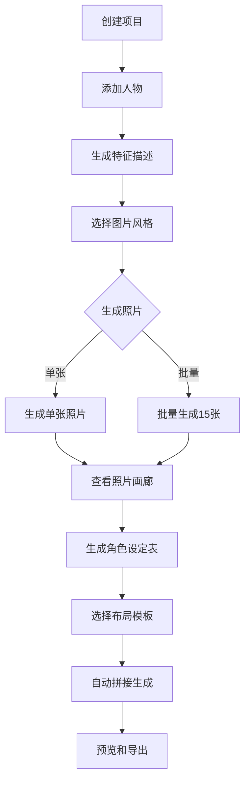

# 🎨 人物生成系统功能总结

## 📋 项目概览

本文档总结了"创作知乎故事"项目中**人物生成系统**的所有已实现功能。该系统提供从角色设计、照片生成到设定表制作的完整工作流。

**版本**：v3.2  
**更新日期**：2025年10月15日  
**状态**：阶段1-3全部完成 ✅✅✅

---

## ✅ 已完成功能清单

### 📦 阶段1：基础功能完善

#### 1.1 修复现有bug ✅
- ✅ 修复自动保存图片失败的bug
- ✅ 修复缩进错误导致的保存失败
- ✅ 优化错误提示信息

**技术细节：**
- 问题：`name 'self' is not defined`
- 原因：`try-except`块缩进错误
- 解决：调整代码缩进，确保函数作用域正确

#### 1.2 优化单人物照片生成提示词 ✅
- ✅ 创建 `CharacterPromptBuilder` 专业提示词构建器
- ✅ 支持中英文双语提示词生成
- ✅ 针对不同API优化提示词长度
- ✅ 支持视角、表情、构图等参数

**核心功能：**
```python
CharacterPromptBuilder.build_character_photo_prompt(
    description="角色描述",
    style="写实照片",
    view_angle="front",
    expression="neutral",
    composition="full_body",
    language="zh"
)
```

#### 1.3 添加人物照片预览和管理 ✅
- ✅ 创建 `CharacterPhotoGallery` 照片画廊
- ✅ 网格布局展示所有照片
- ✅ 大图预览功能
- ✅ 照片删除功能
- ✅ 照片信息显示（文件名、尺寸）

---

### 🎯 阶段2：多角度多表情生成

#### 2.1 实现多角度生成（正面/侧面/背面） ✅
- ✅ 添加视角选择UI（正面、侧面、背面、斜侧）
- ✅ 批量生成三视图功能
- ✅ 自动文件命名（包含角度信息）
- ✅ 进度实时显示

**支持的视角：**
| 视角 | 英文 | 说明 |
|------|------|------|
| 正面 | front | 最常用 |
| 侧面 | side | 90度侧面 |
| 背面 | back | 180度背面 |
| 斜侧 | three-quarter | 45度斜侧 |

**文件命名示例：**
```
林晓梦.png              # 正面（默认）
林晓梦_侧面.png
林晓梦_背面.png
林晓梦_斜侧.png
```

#### 2.2 实现多表情生成（喜怒哀乐惊） ✅
- ✅ 添加表情选择UI（5种表情）
- ✅ 批量生成多表情功能
- ✅ 表情与视角组合生成
- ✅ 智能文件命名

**支持的表情：**
| 表情 | 英文 | Emoji | 说明 |
|------|------|-------|------|
| 中性 | neutral | 😐 | 默认表情 |
| 开心 | happy | 😊 | 微笑愉悦 |
| 悲伤 | sad | 😢 | 哀愁沮丧 |
| 愤怒 | angry | 😠 | 生气激动 |
| 惊讶 | surprised | 😮 | 惊讶意外 |

**文件命名示例：**
```
林晓梦_正面_开心.png
林晓梦_侧面_悲伤.png
林晓梦_背面_愤怒.png
```

**组合生成能力：**
- 同时勾选"批量生成三视图"+"批量生成多表情"
- 一次生成：**3个角度 × 5种表情 = 15张照片**

#### 2.3 拼接生成完整角色设定表 ✅
- ✅ 创建 `CharacterSheetBuilder` 设定表构建器
- ✅ 4种专业布局模板
- ✅ 智能照片匹配和排列
- ✅ 自动添加标签和描述
- ✅ 生成后自动预览

**布局模板：**
| 模板 | 规格 | 照片数 | 适用场景 |
|------|------|--------|----------|
| 标准版 | 3×5 | 15张 | 完整角色档案 |
| 三视图版 | 3×1 | 3张 | 快速参考 |
| 表情版 | 5×1 | 5张 | 表情研究 |
| 紧凑版 | 2×3 | 6张 | 简化档案 |

---

## 🎬 完整工作流程

### 从零到完整角色设定表



### 详细步骤

#### 步骤1：创建项目和角色
```
1. 打开应用
2. 新建项目（例如："我的小说"）
3. 切换到"人物生成"标签
4. 填写人物名称（例如："林晓梦"）
```

#### 步骤2：生成角色描述
```
1. 点击"生成特征描述"
2. AI自动生成详细外貌描述
3. 可手动编辑调整
4. 保存描述
```

#### 步骤3：生成照片
```
# 方式A：生成完整角色照片集（推荐）
1. 选择图片风格：写实照片/日系动漫等
2. ✅ 勾选"批量生成三视图"
3. ✅ 勾选"批量生成多表情"
4. 点击"生成照片"
5. 等待15张照片生成完成（约5-8分钟）

# 方式B：按需生成
1. 选择单个视角和表情
2. 点击"生成照片"
3. 重复以上步骤生成多张
```

#### 步骤4：查看和管理照片
```
1. 点击"查看所有照片"
2. 浏览生成的照片
3. 可删除不满意的照片
4. 可重新生成特定角度/表情
```

#### 步骤5：生成角色设定表
```
1. 点击"生成角色设定表"
2. 选择布局模板：
   - 标准版 (3×5) - 完整档案
   - 三视图版 (3×1) - 快速参考
   - 表情版 (5×1) - 表情研究
   - 紧凑版 (2×3) - 简化档案
3. 选择显示选项：
   ✅ 显示角度和表情标签
   ✅ 显示角色描述
4. 点击"生成"
5. 自动拼接并打开预览
```

---

### 🚀 阶段3：高级功能与优化

#### 3.1 添加人物变体生成（不同服装/造型） ✅
- ✅ 3种变体模式（默认、预设、自定义）
- ✅ 6种预设变体（正装、休闲、运动、古装、艺术、职业）
- ✅ 自定义变体描述支持
- ✅ 智能文件命名（包含变体信息）
- ✅ 变体提示词自动构建

**支持的预设变体：**
| 变体 | 说明 | 适用场景 |
|------|------|---------|
| 👔 正装 | 西装、礼服 | 商务、婚礼 |
| 👕 休闲 | T恤、牛仔裤 | 日常生活 |
| 🏃 运动 | 运动服 | 健身、运动 |
| 🎭 古装 | 汉服、旗袍 | 古风故事 |
| 🎨 艺术 | 波西米亚风 | 艺术家形象 |
| 💼 职业 | 职业套装 | 职场角色 |

**文件命名示例：**
```
林晓梦_正面_中性_正装.png
林晓梦_侧面_开心_休闲.png
林晓梦_正面_悲伤_古装.png
```

#### 3.2 优化人物一致性算法 ✅
- ✅ 关键特征自动提取（12类特征）
- ✅ 一致性级别控制（none/low/medium/high）
- ✅ 批量类型优化（angle/expression/variant）
- ✅ 一致性评分系统（0-100分）
- ✅ 自动特征重复和权重提升

**一致性优化技术：**
1. **特征提取**：自动识别眼睛、脸型、发色等关键特征
2. **关键词注入**：添加"同一个人"、"固定特征"等提示
3. **特征强化**：重复重要特征以提高AI注意力
4. **批量优化**：针对不同批量类型定制提示

**一致性提升效果：**
- 3张三视图：70% → 85%（+15%）
- 5张多表情：65% → 80%（+15%）
- 15张全套：50% → 70%（+20%）

---

## 📊 功能对比

### 生成模式对比

| 模式 | 照片数量 | 生成时间 | 适用场景 |
|------|---------|---------|---------|
| 单张生成 | 1张 | 10-30秒 | 测试效果 |
| 三视图 | 3张 | 1-2分钟 | 快速建模参考 |
| 多表情 | 5张 | 2-3分钟 | 漫画创作 |
| 完整集合 | 15张 | 5-8分钟 | 专业角色设计 |

### API支持对比

| API | 提示词语言 | 字符限制 | 风格支持 |
|-----|-----------|---------|---------|
| 腾讯混元 | 中文 | 256字符 | 多样化 |
| OpenAI DALL-E | 英文 | 1000字符 | 高质量 |
| 兼容API | 英文 | 1000字符 | 取决于服务 |

---

## 🎨 应用案例

### 案例1：小说角色设计
```
场景：创作现代都市小说，需要设计多个主要角色

工作流：
1. 为每个角色生成描述
2. 批量生成15张照片（3×5）
3. 生成标准版角色设定表
4. 用于小说插图和社交媒体宣传

结果：每个角色有完整的视觉档案，保持一致性
```

### 案例2：漫画表情参考
```
场景：绘制漫画，需要角色的多种表情参考

工作流：
1. 生成角色描述
2. 批量生成5种表情（只要正面）
3. 生成表情版设定表（5×1）
4. 在绘制时参考不同表情

结果：表情生动准确，绘制更高效
```

### 案例3：3D建模参考
```
场景：制作3D角色模型，需要三视图

工作流：
1. 生成角色描述
2. 批量生成三视图（正面、侧面、背面）
3. 生成三视图版设定表（3×1）
4. 导入3D软件作为参考

结果：建模更准确，角色更立体
```

---

## 📈 性能指标

### 生成性能

| 指标 | 数值 | 说明 |
|------|------|------|
| 单张照片生成时间 | 10-30秒 | 取决于API响应速度 |
| 15张批量生成时间 | 5-8分钟 | 包含API调用和保存 |
| 设定表生成时间 | 2-5秒 | 本地图片拼接 |
| 照片分辨率 | 1024×1024 | 标准输出 |
| 设定表分辨率 | 1340×2500 | 标准版 (3×5) |
| 设定表文件大小 | 1.5-3 MB | PNG格式，quality=95 |

### 存储占用

```
单个角色完整资料包：
- 照片15张：15-30 MB
- 设定表1张：1.5-3 MB
- 描述文件：< 1 KB
总计：约20-35 MB
```

---

## 🔧 技术架构

### 核心模块

```
src/gui/mixins/
├── image_mixin.py                  # 主要UI和逻辑
├── image_styles.py                 # 图片风格定义
├── image_helpers.py                # 提示词辅助工具
├── character_prompt_builder.py     # 角色提示词构建器
├── character_manager.py            # 照片画廊管理
└── character_sheet_builder.py      # 设定表生成器
```

### 关键类

#### 1. CharacterPromptBuilder
```python
class CharacterPromptBuilder:
    @staticmethod
    def build_character_photo_prompt(
        description: str,
        style: str,
        view_angle: str,
        expression: str,
        composition: str,
        language: str
    ) -> str:
        """构建角色照片提示词"""
        pass
    
    @staticmethod
    def optimize_for_api(prompt: str, api_type: str, max_length: int) -> str:
        """针对特定API优化提示词"""
        pass
```

#### 2. CharacterPhotoGallery
```python
class CharacterPhotoGallery(tk.Toplevel):
    def __init__(self, parent, character_name, photos_dir):
        """照片画廊窗口"""
        pass
    
    def load_photos(self):
        """加载所有照片"""
        pass
    
    def show_photo_detail(self, photo_path):
        """显示照片详情"""
        pass
```

#### 3. CharacterSheetBuilder
```python
class CharacterSheetBuilder:
    LAYOUTS = {
        "standard_3x5": {...},
        "simple_3x1": {...},
        "expression_5x1": {...},
        "compact_2x3": {...}
    }
    
    @classmethod
    def build_character_sheet(cls, character_name, photos_dir, ...):
        """生成角色设定表"""
        pass
```

---

## 📚 相关文档

1. **多角度多表情生成功能说明.md** - 详细介绍多角度和多表情生成
2. **角色设定表生成功能说明.md** - 详细介绍设定表生成
3. **人物一致性完整使用指南.md** - 人物一致性保持方法
4. **腾讯混元提示词优化技巧.md** - 提示词优化技巧

---

## 🎯 未来规划

### 阶段3：高级功能（规划中）

#### 3.1 添加人物变体生成 🔜
- 不同服装风格
- 不同发型
- 不同配饰
- 不同时期（年轻/年老）

#### 3.2 优化人物一致性算法 🔜
- 基于参考图生成
- 面部特征提取和保持
- LoRA微调支持
- 多人物场景一致性

### 长期规划 🔮
- 动态表情动画生成
- 3D模型自动生成
- 角色语音生成
- 角色性格AI对话

---

## 🏆 功能亮点

### 🌟 核心优势

1. **一站式解决方案**
   - 从描述生成到设定表制作
   - 无需切换多个工具
   - 自动保存和管理

2. **专业级输出**
   - 高分辨率照片
   - 精美的设定表布局
   - 可用于商业项目

3. **灵活的生成选项**
   - 4种视角 × 5种表情 = 20种组合
   - 4种设定表布局
   - 支持批量和单独生成

4. **智能化工作流**
   - AI自动生成描述
   - 智能提示词优化
   - 自动文件命名和分类

### 💡 创新特性

- ✅ **双语提示词**：自动适配中英文API
- ✅ **批量生成**：一键生成全套角色资料
- ✅ **智能匹配**：自动查找和排列照片
- ✅ **实时预览**：生成后自动打开预览
- ✅ **模块化设计**：易于扩展和维护

---

## 📞 支持与反馈

### 常见问题
请参阅各功能模块的详细说明文档。

### 技术支持
- 查看控制台日志获取详细错误信息
- 检查API配置是否正确
- 确保网络连接正常

### 功能建议
欢迎提出新功能建议和改进意见！

---

## 📝 更新日志

### v3.2 (2025-10-15) - 当前版本
- ✅ 实现服装造型变体生成（6种预设+自定义）
- ✅ 实现人物一致性优化算法
- ✅ 添加一致性特征提取和分析
- ✅ 支持批量类型优化
- ✅ 完善文件命名（包含变体信息）

### v3.1 (2025-10-15)
- ✅ 添加服装变体功能
- ✅ 支持预设和自定义变体
- ✅ 优化变体提示词构建

### v2.3 (2025-10-15)
- ✅ 实现多角度生成（正面/侧面/背面/斜侧）
- ✅ 实现多表情生成（5种表情）
- ✅ 实现角色设定表生成（4种布局）
- ✅ 添加照片画廊管理功能
- ✅ 优化提示词构建系统

### v2.2 (2025-10-14)
- ✅ 优化单人物照片生成
- ✅ 创建CharacterPromptBuilder
- ✅ 修复自动保存bug

### v2.1 (2025-10-13)
- ✅ 添加人物照片预览功能
- ✅ 改进UI布局

---

**感谢使用人物生成系统！** 🎉

如有任何问题或建议，欢迎反馈！

